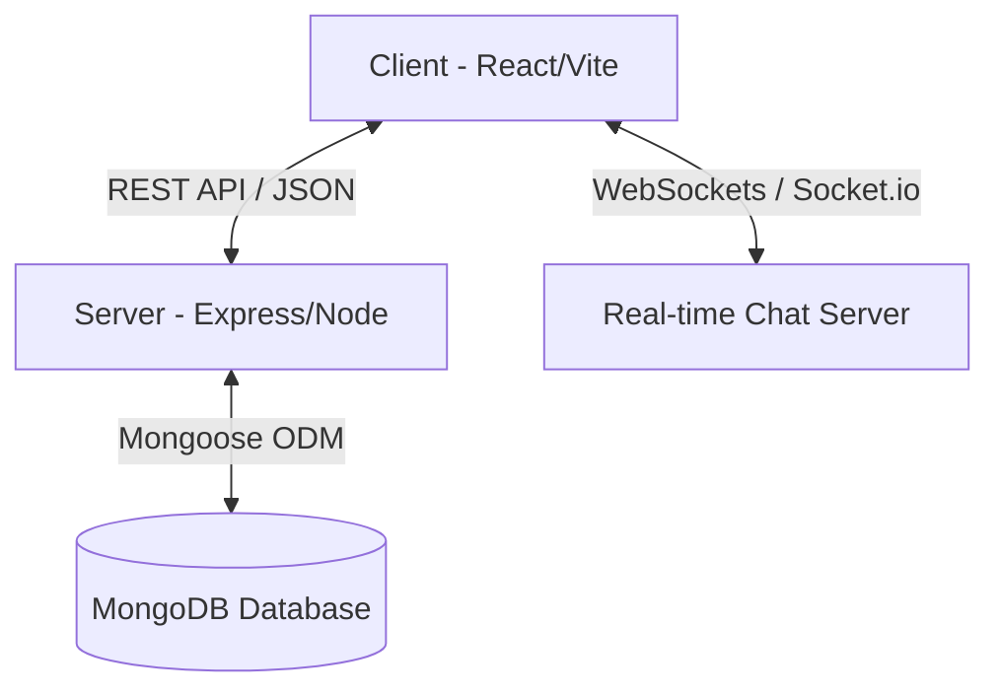

# ProjectNest 🪺

ProjectNest is a modern, collaborative online task and group project management platform. It is designed to streamline project initialization, role-based task delegation, progress tracking, meeting logs, file sharing, and real-time team communication.

## 🛠️ Architecture Overview

The project is structured as a monorepo containing two main parts:
1. **[Client_ProjectNest](file:///home/arun/Documents/code/ProjectNest/Client_ProjectNest)**: The frontend user interface, built with React, Vite, and Tailwind CSS.
2. **[Server_ProjectNest](file:///home/arun/Documents/code/ProjectNest/Server_ProjectNest)**: The backend REST API and WebSocket server, built using Node.js, Express, MongoDB (Mongoose), and Socket.io.



---

## ✨ Features

### 👤 Role-Based Dashboards
ProjectNest provides tailored experiences for three key user roles:

*   **👥 Group Member (Member Role)**: Propose new group workspaces, invite collaborators, view team feeds/announcements, manage assigned tasks, log meeting discussions (logsheets), upload deliverables/reports, and chat with group members and managers in real-time.
*   **👑 Project Manager / Group Leader (Manager Role)**: Review and track group projects, create & assign tasks, track task progress, approve/comment on meeting logs (logsheets), upload guidelines/resources, and chat with the group.
*   **💼 Workspace Admin (Admin Role)**: Oversee project workspace requests, manage active/deleted projects, view archive tables, and manage active/deleted records.

### 💬 Real-Time Collaboration
*   Built-in project chatrooms utilizing Socket.io.
*   Instant messaging and notification updates for tasks and activities.

### 📄 Document & Progress Tracking
*   Upload project proposals, designs, and final reports (PDF format supported).
*   Visual progress tracking via circular progress bars.
*   Logsheets to document meeting agendas, discussions, and get manager approvals.

---

## 🚀 Quick Start & Installation

To run ProjectNest locally, follow these steps:

### Prerequisites
*   [Node.js](https://nodejs.org/) (v18 or higher recommended)
*   [MongoDB](https://www.mongodb.com/) (running instance locally or via MongoDB Atlas)

---

### Step 1: Set up the Backend Server
1. Navigate to the backend directory:
   ```bash
   cd Server_ProjectNest
   ```
2. Install dependencies:
   ```bash
   npm install
   ```
3. Set up environment variables:
   *   Copy `config.env.template` to `config.env`:
       ```bash
       cp config.env.template config.env
       ```
   *   Open `config.env` and populate the required keys:
       ```env
       PORT=3000
       MONGODB_URI=mongodb://localhost:27017/projectnest
       JWT_SECRET=your_jwt_secret_key_here
       JWT_EXPRIES_IN=90d
       JWT_COOKIE_EXPIRES_IN=90
       NODE_ENV=development
       ```
4. Start the server in development mode:
   ```bash
   npm run dev
   ```
   *The backend will run on `http://localhost:3000`, and the Socket.io server will listen on port `8001`.*

---

### Step 2: Set up the Frontend Client
1. Open a new terminal window and navigate to the frontend directory:
   ```bash
   cd Client_ProjectNest
   ```
2. Install dependencies:
   ```bash
   npm install
   ```
3. (Optional) Run mock server if you want to test with JSON server:
   ```bash
   npm run server
   ```
4. Start the client dev server:
   ```bash
   npm run dev
   ```
   *The frontend will run on `http://localhost:5173` (or the port specified by Vite).*

---

## 📂 Project Structure

```
ProjectNest/
├── Client_ProjectNest/     # React + Vite frontend
│   ├── src/
│   │   ├── components/     # UI Components (Admin, Member, Manager, etc.)
│   │   ├── contexts/       # React Contexts (User, Project, Socket)
│   │   ├── layouts/        # Layout wrappers
│   │   ├── pages/          # App views (Login, Dashboards, Projects)
│   │   └── utils/          # Protected routes and common helpers
│   ├── public/             # Static assets
│   ├── tailwind.config.js  # Styling settings
│   └── package.json        # Frontend scripts and dependencies
│
└── Server_ProjectNest/     # Node + Express + Mongoose backend
    ├── controller/         # Request handling logic (auth, project, user, etc.)
    ├── models/             # Mongoose database schemas
    ├── router/             # Express API routes
    ├── utils/              # Custom error handling, authentication filters, user roles
    ├── public/             # Uploaded files destination
    ├── server.js           # Server entrypoint and Socket.io socket handlers
    ├── app.js              # Express app setup and middleware
    └── package.json        # Backend scripts and dependencies
```
